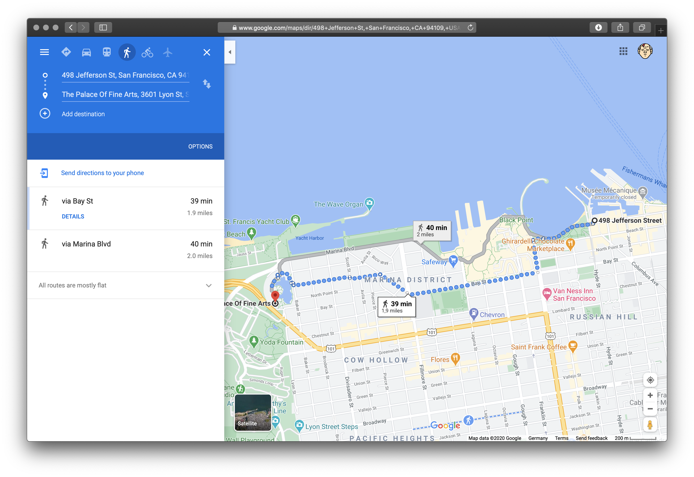

# Chapter 2
He woke up at 6am and went for a short [morning run](https://www.google.com/maps/dir/Good+Hotel,+112+7th+St,+San+Francisco,+CA+94103,+United+States/37.7937538,-122.3927986/37.8067123,-122.4059284/37.8048135,-122.4202621/37.7791411,-122.4151552/37.7789036,-122.4114645/@37.7969974,-122.4148977,15z/data=!4m13!4m12!1m5!1m1!1s0x8085808365424cf5:0x1bb060c1ef569508!2m2!1d-122.4109849!2d37.7789625!1m0!1m0!1m0!1m0!1m0!3e2).
After a quick shower, he dressed up and left his hotel. He decided to take
a walk to Sasha's hotel with a quick stop at a coffee shop.

The weather was splendid and he enjoyed the walk through the morning streets of San Francisco. His mind was calm but in the back of his mind he was still analyzing his yesterday's encounter.

He got the coffee to go at ... and went to the hotel to meet Sasha. He walked
into the lobby of Mariott at 8:45am and went straight to the reception.
> - "Good Morning!"
> - "Good Morning, Sir. How can I help you?" - the gay guy at the counter was
>  smiling at him
> - "I'm here to meet my friend Alexandra Schwartz. Could you, maybe, give her
> a call and tell her that her friend is waiting in the lobby?"
> - "Sure Sir. Your name is?"
> - "Arthur, Arthur Such."
> - "Give me a moment, sir."

He took a step back and looked around the lobby. There wasn't anything
suspicious. All of sudden his mobile phone started to vibrate. He pulled it out
of his pocket: `Unknown number from Budapest? That's weird.`

Normally he wasn't answering calls from unknown numbers but something back in
his mind convinced him he should take it this time
> - "Yeah"
> - "Just listen!" - the voice was coming through a distortion device
> "I know that you're standing in the lobby of a Mariott in SF waiting for your
> friend. She's dead. Someone is trying to set you up, you have to get out."
> "Who the fuck are.." - the call was over.

He went straight to the counter. He was trying to sound calm.
> - "Sorry mate I got an important call and have to leave immediately. Could
>   you, please, tell Alexandra that I will call her later."
> - "Sure, Sir. I couldn't reach her but I will leave a note for her from you."

`Ok, he couldn't reach her. Maybe she was just taking a shower.` He was hoping
that the caller from Budapest was wrong but if he wasn't - he relly have to get
out of the country and he has to do it rather fast.

He walked out of the building and went towards the pier. He needed to blend in
with the crowd and make a call.
Who the fuck has warned him. How did he get his number and how did he know where is he or who he's about to meet with.

```
I guess "someone was following me yesterday" wasn't just a feeling.
They probably saw me talking to Sasha in the coffee shop. Ok,
whatever I'll deal with it later.
Let's think, it's 9:15am now, room service we'll clean the room around 11am
- I have about 2 hours until they potentially find the body. Police will
arrive in another 15 minutes and will start talking to the staff.
```

It was the time to call the [gorodovoy](https://ru.wikipedia.org/wiki/%D0%93%D0%BE%D1%80%D0%BE%D0%B4%D0%BE%D0%B2%D0%BE%D0%B9). Every city with major operations has one. He got his phone out.

> - "Hi Vlad!"
> - "Oh, hi there! What's up? I'm at the beach about to catch my first wave."
> - "That's great but I need your help and I need it fast. I'm in trouble."
> - "Fuck, man - you're always calling to destroy my day." - he heard him
>   smiling. "Where do you want to meet?"
> - "How about in 40 minutes at [Palace of Fine Arts](https://en.wikipedia.org/wiki/Palace_of_Fine_Arts)"
> - "Ok, see you in 40 minutes, fucker 😀"

[](https://www.google.com/maps/dir/37.8077107,-122.4204267/37.8024925,-122.4487285/@37.8038963,-122.4433286,15z/data=!3m1!4b1!4m2!4m1!3e2)

He didn't want to take an UBER, that's why he decided to [walk](https://www.google.com/maps/dir/37.8077107,-122.4204267/37.8024925,-122.4487285/@37.8038963,-122.4433286,15z/data=!3m1!4b1!4m2!4m1!3e2). It will give him
some time to think about the situation and not being noticed by a cab driver - the less exposure the better.

Weirdly enough he met Vlad for the first time in Budapest two years ago. Back then they were working on the [Transcarpathia](https://www.euractiv.com/section/eastern-europe/news/hungary-and-ukraine-exchange-warnings-over-transcarpathia/) case to get the "healthy" tension between Ukraine and Hungary going. He was associated with one Budapest based startup that drove some social media campaigns that caught the attention of [AH](https://en.wikipedia.org/wiki/Constitution_Protection_Office), so he needed to leave Hungary in a safe manner.
