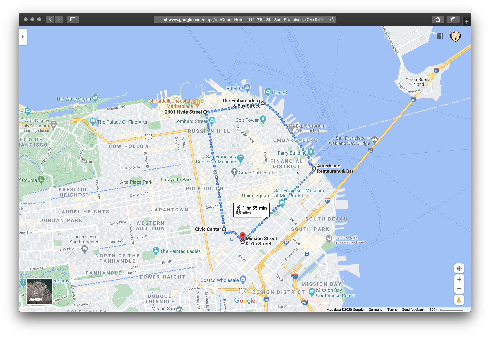
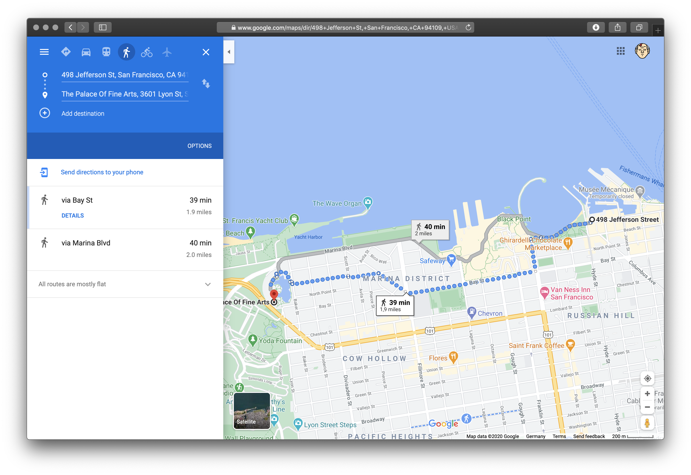
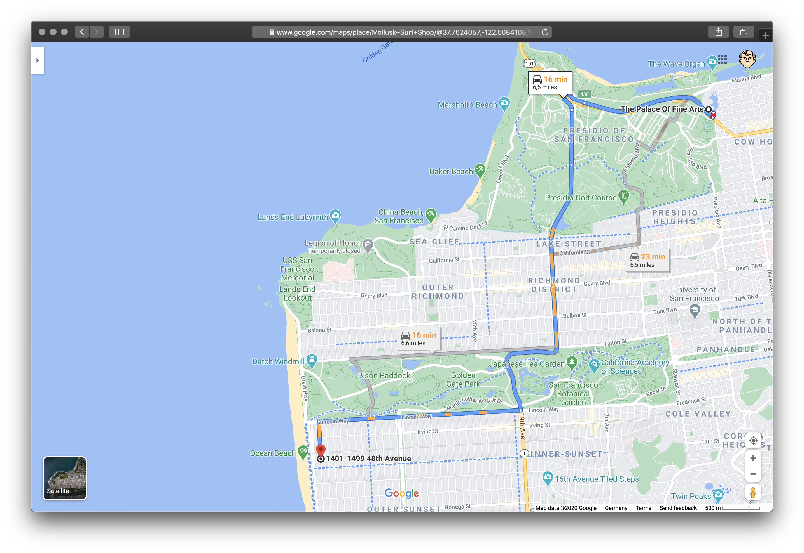
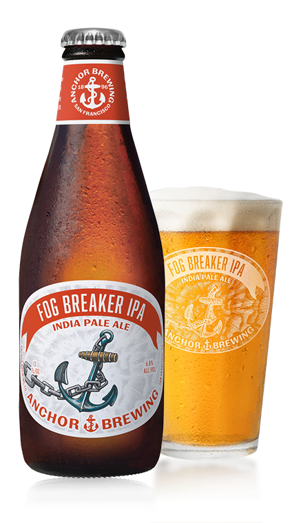

# Chapter 2
He woke up at 6am and went for a short morning run.

[](https://www.google.com/maps/dir/Good+Hotel,+112+7th+St,+San+Francisco,+CA+94103,+United+States/37.7937538,-122.3927986/37.8067123,-122.4059284/37.8048135,-122.4202621/37.7791411,-122.4151552/37.7789036,-122.4114645/@37.7969974,-122.4148977,15z/data=!4m13!4m12!1m5!1m1!1s0x8085808365424cf5:0x1bb060c1ef569508!2m2!1d-122.4109849!2d37.7789625!1m0!1m0!1m0!1m0!1m0!3e2)

After a quick shower, he dressed up and left his hotel. He decided to take
a walk to Sasha's hotel with a quick stop at a coffee shop.

The weather was splendid and he enjoyed the walk through the morning streets of San Francisco. His mind was calm but in the back of his mind he was still analyzing his yesterday's encounter.

He got the coffee to go at ... and went to the hotel to meet Sasha. He walked
into the lobby of Mariott at 8:45am and went straight to the reception.
> - "Good Morning!"
> - "Good Morning, Sir. How can I help you?" - the gay guy at the counter was
>  smiling at him
> - "I'm here to meet my friend Alexandra Schwartz. Could you, maybe, give her
> a call and tell her that her friend is waiting in the lobby?"
> - "Sure Sir. Your name is?"
> - "Arthur, Arthur Such."
> - "Give me a moment, sir."

He took a step back and looked around the lobby. There wasn't anything
suspicious. All of sudden his mobile phone started to vibrate. He pulled it out
of his pocket: `Unknown number from Budapest? That's weird.`

Normally he wasn't answering calls from unknown numbers but something back in
his mind convinced him he should take it this time
> - "Yeah"
> - "Just listen!" - the voice was coming through a distortion device
> "I know that you're standing in the lobby of a Mariott in SF waiting for your
> friend. She's dead. Someone is trying to set you up, you have to get out."
> "Who the fuck are.." - the call was over.

He went straight to the counter. He was trying to sound calm.
> - "Sorry mate I got an important call and have to leave immediately. Could
>   you, please, tell Alexandra that I will call her later."
> - "Sure, Sir. I couldn't reach her but I will leave a note for her from you."

`Ok, he couldn't reach her. Maybe she was just taking a shower.` He was hoping
that the caller from Budapest was wrong but if he wasn't - he relly have to get
out of the country and he has to do it rather fast.

He walked out of the building and went towards the pier. He needed to blend in
with the crowd and make a call.
Who the fuck has warned him. How did he get his number and how did he know where is he or who he's about to meet with.

```
I guess "someone was following me yesterday" wasn't just a feeling.
They probably saw me talking to Sasha in the coffee shop. Ok,
whatever I'll deal with it later.
Let's think, it's 9:15am now, room service we'll clean the room around 11am
- I have about 2 hours until they potentially find the body. Police will
arrive in another 15 minutes and will start talking to the staff.
```

It was the time to call the [gorodovoy](https://ru.wikipedia.org/wiki/%D0%93%D0%BE%D1%80%D0%BE%D0%B4%D0%BE%D0%B2%D0%BE%D0%B9). Every city with major operations has one. He got his phone out.

> - "Hi Vlad!"
> - "Oh, hi there! What's up? I'm at the beach about to catch my first wave."
> - "That's great but I need your help and I need it fast. I'm in trouble."
> - "Fuck, man - you're always calling to destroy my day." - he heard him
>   smiling. "Where do you want to meet?"
> - "How about in 40 minutes at [Palace of Fine Arts](https://en.wikipedia.org/wiki/Palace_of_Fine_Arts)"
> - "Ok, see you in 40 minutes, fucker 😀"

[](https://www.google.com/maps/dir/37.8077107,-122.4204267/37.8024925,-122.4487285/@37.8038963,-122.4433286,15z/data=!3m1!4b1!4m2!4m1!3e2)

He didn't want to take an UBER, that's why he decided to [walk](https://www.google.com/maps/dir/37.8077107,-122.4204267/37.8024925,-122.4487285/@37.8038963,-122.4433286,15z/data=!3m1!4b1!4m2!4m1!3e2). It will give him
some time to think about the situation and not being noticed by a cab driver - the less exposure the better.

Weirdly enough he met Vlad for the first time in Budapest two years ago. Back then they were working on the [Transcarpathia](https://www.euractiv.com/section/eastern-europe/news/hungary-and-ukraine-exchange-warnings-over-transcarpathia/) case to get the "healthy" tension between Ukraine and Hungary going. He was associated with one Budapest based startup that drove some social media campaigns that caught the attention of [AH](https://en.wikipedia.org/wiki/Constitution_Protection_Office), so he needed to leave Hungary in a safe manner.

He was walking the streets of San Francisco trying to concentrate on what's
happened and what he should do next. Back in his head he was still thinking
about the call he received this morning - `who the could that have been?`. He had
a peculiar feeling that it won't be the last time he will get a call from this person.

He saw Vlad from far, he looked fresh as always - tanned with white surfer hair
he obviously enjoyed his new life in California. Sipping on his coffee or tea,
he was chatting on the phone. Once he spotted Arthur, he waved his hand showing
the direction and started walking. They met in around 50 metres and walked
together.

> - "Where are we going?"
> - "To my car. It's very nice seeing you, man. How have you been?"
> - "Great until today's morning. How are you?"
> - "I'm awesome dude. I love it here. The weather is great, the nature is
>   amazing - terrific place."
> - "Don't you miss Europe - all the history and culture?"
> - "C'mon man, we grew up in the same place, you remember how we were dragged
>   to the museums and theaters and philarmonies when we were kids - I'm tired
>   of it. And let's be honest nowadays Europe is kinda almost the same
>   everywhere - it's become either a Middle East or North Africa almost
>   everywhere" - he smiled. "Get into the car".

They got into Vlad's white Miata and drove to Vlad's house.

> - "Ok, tell me what's the problem? What brings you to uncle Vlad."
> - "I think I'm in a deep shit."
> - "Again? What's happened this time? What law did you break? Did you kill
>   someone?"
> - "You know I would never do. I think someone is trying to set me up.  Imet
>   a girl yesterda..."
> - "Here we go - all the fucking problems you straight guys have are because
>   of the pussy. Was it at least worth it? 😂"
> - "Vlad, it's not fucking funny. I met Sasha from Munich, you remember, I was
>   telling you about her in Budapest."
> - "The girl you were working with in Munich, right, when you were building
>   your legend."
> - "Exactly. I had to meet her for a walk today in the morning. I alread y was
>   in the lobby of her hotel and got a call from, funny-funny, Budapest.
>   Whoever was on the other end told me that Sasha is dead and I should get
>   out of there. So, I asked the guy at the desk to cal her but she didn't
>   answer. Now, I have to get out of the country and probably not under the
>   name I entered US - just in case."

They arrived at Vlad's house, parked the car and went inside.

[](https://www.google.com/maps/dir/Palace+of+Fine+Arts,+3601+Lyon+St,+San+Francisco,+CA+94123,+Vereinigte+Staaten/1401+48th+Ave,+San+Francisco,+CA+94122,+USA/@37.7820113,-122.4955958,14z/data=!3m1!4b1!4m14!4m13!1m5!1m1!1s0x808586d510144681:0xe960db8a581aacf5!2m2!1d-122.4486055!2d37.8020068!1m5!1m1!1s0x80858796bd4ef215:0xabaaaba699627164!2m2!1d-122.5082746!2d37.7601747!3e0?authuser=2)

> - "Do you want a drink, cause I need one to relax a bit and think."
> - "I'd get an IPA, I know you have one."
> - "Sure, serve yourself - there's plenty in the fridge. I'll go with red
>   wine."

He went to the fridge and took a bottle of Fog Breaker IPA.

<p align="center" width="100%">
  <a href="https://www.anchorbrewing.com/beer/fog_breaker_ipa" alt="Fog Beaker
IPA" target="_blank">
    
  </a>
</p>

> - "Ok, so - do you have a second passport you can use to leave the country?
>   Honestly I shouldn't even ask this question - you should fucking have one."
> - "Yes, I do but I haven't used in a while. I kinda got used to my identity."
> - "Leave this explanation to your shrink, once you will be allowed to talk to
>   one. You'll be fine. We'll have to get you on a private jet anyways. If
>   Sasha is really in a better place, I wouldn't risk to get you on a regular
>   plane" - he was walking up and down his living room thinking. "Let me make
>   a couple of calls to see if we can get you on the plane to Europe
>   tomorrow."
> - "Sure. Thanks man. I really appreciate it and I really like to see you.
>   Don't you want to catch a plane with me and spend a week or two in Europe?"
> - "No way! As I said - Europe is not my piece of cake anymore. Ok, relax for
>   a bit."

It was a very nice and warm California evening. Vlad's house was so close
to the ocean that you could hear it grolling. He loved ocean but would prefer
to be somewhere more remote and calm than SF - Azores, it would be great to be
there now. Vlad walked back into the room.

> - "Ok, we have it - daddy solved all your problems. You fly tomorrow to your
>   beloved Budapest from [Oakland International](https://en.wikipedia.org/wiki/Oakland_International_Airport) at 8am with one more guy - some Hungarian businessman that flies back home.

<p align="center" width="100%">
  <a href="https://en.wikipedia.org/wiki/Oakland_International_Airport" alt="Oakland International AirportFog Beaker
IPA" target="_blank">
    
  </a>
</p>

> - "Thanks for saving my ass again, man!"
> - "It's my job - you don't have to thank me. Ok, try to relax until tomorrow, I'll go visit my boyfriend and will pick you up tomorrow."
> - "Who do you think have called me from Budapest in the morning? Do you think
>   it was one of our guys?"
> - "You've been with the `mothership` long enough and should know that there's no such
thing as `our guys`. We have a very good relationship with you but when the Mothership will force
me to choose between my ass and yours, I will prefer mine any time of the day - I like my ass 😉. Most of `our guys` will do the same. Ok, I'm going out tonight, my extremely handsome friends are waiting to celebrate my dance moves. I'll pick you up at 6am tomorrow. Try to get some rest."
> - "Sure, please, go enjoy yourself. I'll try to get some sleep. It's been
>   a rough couple of days."
> - "Thanks dad but I don't need your permission. I'm a grown up proud gay boy
>   😄. Ok, mate, see you in the morning."

Vlad left his unfinished glass of red wine in the kitchen, took his keys and the
wallet and set off.

Arthur some time thinking about the past day drinking some more beers just
trying to `relax` in an old-fashioned way until he started to fall asleep.
